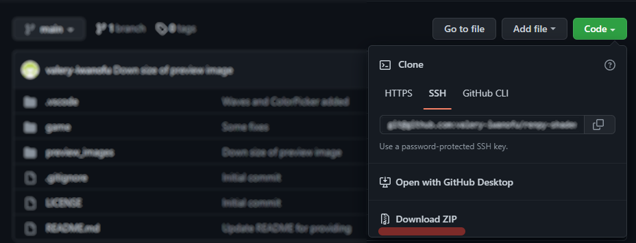

# Yandex Mobile Ads в Ren'Py игре


# Описание
Данный репозиторий содержит модифицированные файлы из папки rapt, которые позволят вам добавить рекламный баннер в игру сделанную на Ren'Py.

# Установка
1. Продуплируйте папки **rapt/templates** и **rapt/prototype**(с целью бэкапа)
2. Скачайте данный репозиторий

3. Переместите все файлы из папки **скачанный_архив/rapt** в папку **rapt**(согласитесь на замену)
4. Откройте файл **rapt/prototype/renpyandroid/src/main/java/org/renpy/android/PythonSDLActivity.java** в редакторе и замените *AD_ID* на свой собственный уникальный идентификатор рекламного места:
```java
    // было
    private static final String AD_ID = "R-M-DEMO-320x50";
    // стало
    private static final String AD_ID = "R-M-XXXXXXX-Y";
```
5. Удалите папку **rapt/project** или файл **rapt/project/build.txt** для того, чтобы Ren'Py заново сгенерировал файлы для сборки

Если вы всё сделали правильно, то после сборки в вашей игре должен появиться рекламный баннер.

## Видео с установкой
[](https://youtu.be/Aj6LSruOnT8)

## Ручная настройка
TODO

# Поддержать автора
* [Boosty](https://boosty.to/iwanofu)
