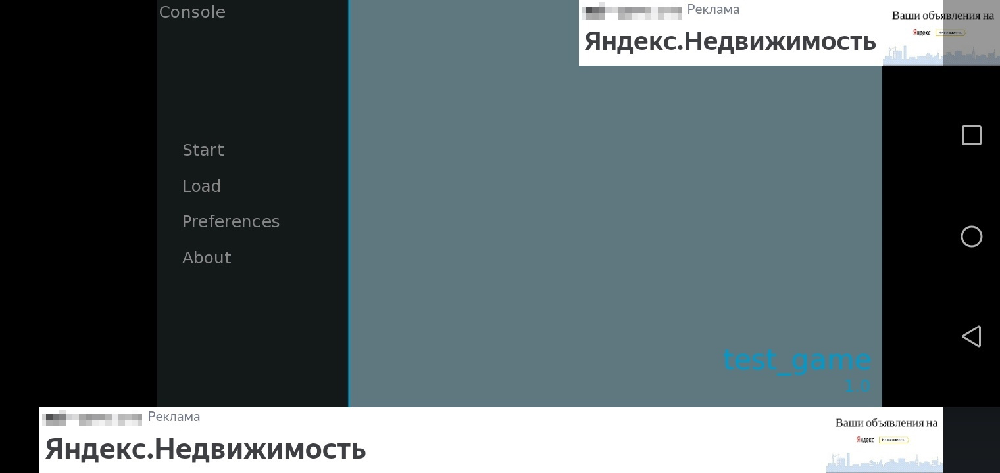

# Yandex Mobile Ads в Ren'Py игре
Данный репозиторий содержит модифицированные файлы из папки rapt, которые позволят вам добавить рекламный баннер в игру сделанную на Ren'Py.


# How to
## Установка
*Папка **rapt** находится в директории, где лежит исполняемый файл Ren'Py(**renpy.exe**).*
1. Продуплируйте папки **rapt/templates** и **rapt/prototype**(с целью бэкапа)
2. Скачайте данный репозиторий

3. Переместите все файлы из папки **скачанный_архив/rapt** в папку **rapt**(согласитесь на замену)
4. Переместите файл **yandex_ads.py** в папку **game** вашего Ren'Py проекта
5. Импортируйте модуль yandex_ads в ваш Ren'Py проект, используя следующий код:
```python
# данный код можно прописать в любом файле вашего проекта(например, в script.rpy)

init python:
  if renpy.android:
    import yandex_ads
```
6. Удалите папку **rapt/project** или файл **rapt/project/build.txt** для того, чтобы Ren'Py заново сгенерировал файлы для сборки

## Создание баннера
```python
init python:
  if renpy.android:
    banner = yandex_ads.create_banner()

    # первым делом необходимо установить размер баннера
    # помните - сделать это можно только один раз
    banner.set_sticky_size(-1)

    # по умолчанию баннер будет находиться "под игрой"
    # с помощью set_position можно изменить положение баннера в любое время
    banner.set_position('above_game') # при значении above_game, баннер будет находиться "над игрой"

    # ad_unit_id можно взять в партнёрском кабинете
    banner.set_ad_unit_id("R-M-XXXXXX-Y")

    # не забудьте загрузить объявление
    banner.load_ad()
```

### Доступные значения для set_position()
* bottom
* top
* center
* left
* right
* center_horizontal
* center_vertical
* fill
* fill_horizontal
* fill_vertical
* start
* end
* under_game
* above_game

### Подробнее о размере баннера
```python
# адаптивный размер, где width ширина баннера(можно использовать -1, для того, чтобы растянуть баннер на всю доступную область)
banner.set_sticky_size(width)

# адаптивный размер, где width и height максимально возможные ширина и высота соответственно
banner.set_flexible_size(width, height)

# точный размер
banner.set_size(width, height)
```

*Ширина и высота указывается в dp(density-independent pixels).*

## Видео с установкой(актуально не полностью)
* **PythonSDLActivity.java** редактировать не нужно!*

[](https://youtu.be/Aj6LSruOnT8)

## Ручная настройка
TODO

# Решение проблем
Если у вас возникли проблемы, то создайте issue или свяжитесь со мной используя социальные сети.
* [VK](https://vk.com/id637835411)
* [Discord](https://discordapp.com/users/844095423157239818)

# Поддержать автора
[](https://boosty.to/iwanofu)

